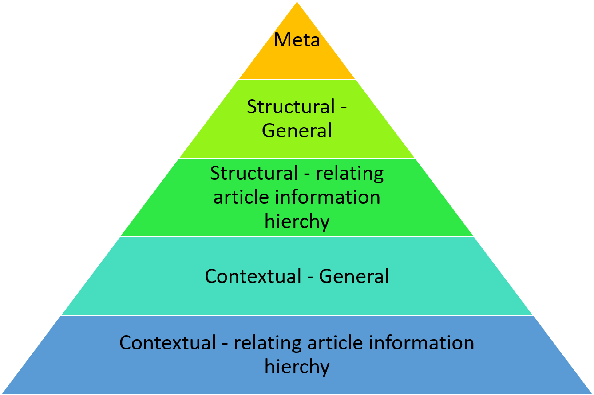
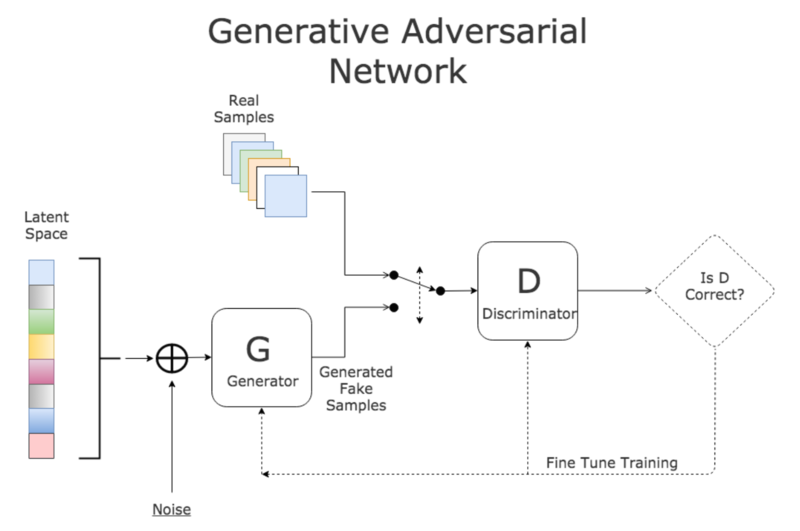
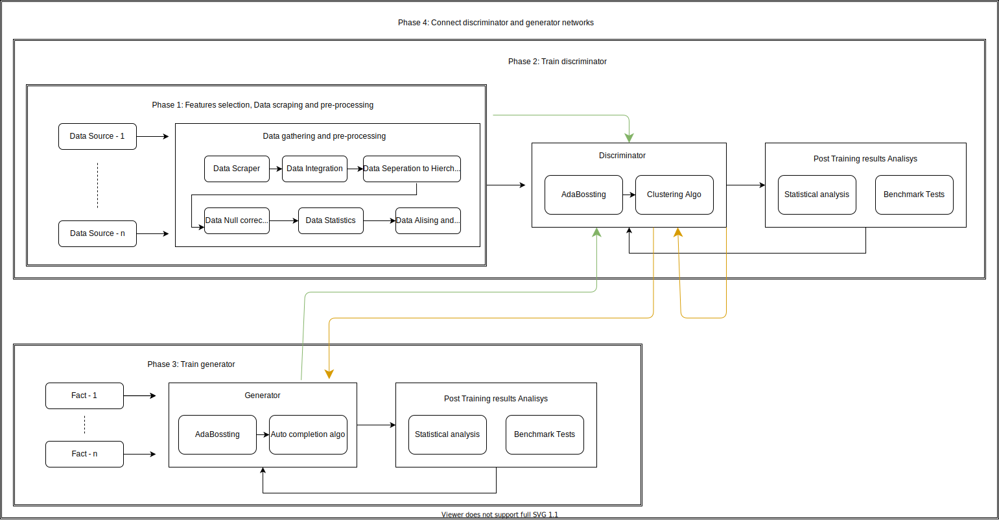

# Data Science Project Design
**Author:** Elad Yitzhaik,

## Assumptions and Out of Scope Topics
### Assumptions
- failure is an option
- articles can be generated from examples
- the major features that contribute a peer approved article can be taken form the article without experience in the field. 

### Out of Scope Topics
- finely tuning the system for maximum results
- Testing many algo variations
- making the system run as embedded or offline
- reducing the complexity (space and time of the system)

## Design Overview and Major Building Blocks
### Features
All features are ordered in a five hierarchy system, ranking from a feature scarcy to feature importance.

  
### System
An adversarial network design in which two networks work against each other.
the first the discriminator is in charge of classifying articles apart, the second the generator is responsible to create realistic fake articles.
The two networks compete in performance when the output of both is fed back to each other.

  

## Detailed Design with Important Flows
  

### Phase 1: Features selection, Data scraping and pre-processing
#### Features selection
| Feature type           | The feature                                 |
| ---------------------- | ------------------------------------------- |
| Meta                   | auther                                      |
|                        | time of creation                            |
|                        | academic institution                        |
|                        | count of previous articles approved         |
|                        | count of previous articles declined         |
|                        | count of previous articles in consideration |
| Structural - general   | word count                                  |
|                        | line count                                  |
|                        | paragraph count                             |
|                        | examples count                              |
|                        | visualisation count                         |
|                        | avg line length                             |
|                        | avg paragraph wc count                      |
|                        | avg paragraph line count                    |
|                        | avg paragraph examples count                |
|                        | avg visualisation per paragraph             |
|                        | words histogram / cloud (words distribution)|
|                        | linguistic usage (Academic ~ Layman)        |
|                        | grammar mistakes                            |
|                        | visualisation histogram (visual distribut)  |
| Structural - article   | title length                                |
|                        | title linguistic usage                      |
|                        | title grammar mistakes                      |
|                        | overview / abstract (all struct features)   |
|                        | topic-1 (all Structural features)           |
|                        | ...                                         |
|                        | topic-n (all struct features)               |
|                        | discussion (all struct features)            |
|                        | future work (all struct features)           |
| Contextual - general   | most meaningful words                       |
|                        | most common words                           |
|                        | word type analysis (noun, adjectives ...)   |
|                        | ...                                         |
| Contextual - article   | Same as before                              |
|                        | ...                                         |

#### Data scraping and pre-processing
- Python class to preform the data scraping (urllib, Requests, Octopus, HTTPie, )
https://www.twilio.com/blog/2016/12/http-requests-in-python-3.html
- Python core libraries to preform Structural analysis.
- Python library for contextual features (NLTK, TextBlob, CoreNLP, spaCy, gensim, Pattern)
https://elitedatascience.com/python-nlp-libraries
- Python functions and 

### Phase 2: Train discriminator
We need to train the discriminator for a benchmark test before we plug it into an adversarial system
- network needs to be able to grow the model after trained from new results ()
- AdaBoosting needs to be applied on the training data
- several approaches of clustering need to be considered (Density, Hiercal, Partitioning ...)
- Create statistics and visualisation on results

### Phase 3: Train generator
We need to train the generator for a benchmark test before we plug it into an adversarial system
- analyse the statistical characteristics of the training data and noise so to add it to the generator network
- create a list of facts that the system can create an article from
- network needs to be able to grow the model after trained from new results ()
- AdaBoosting needs to be applied on the training data
- several approaches of clustering need to be considered (Density, Hiercal, Partitioning ...)
- Create statistics and visualisation on results

### Phase 4: Connect a discriminator and generator networks
- tune the discriminator input to be able to add new information to both the discriminator and the generator
- Create statistics and visualisation on results

## Open Issues
### System
#### General
1. Are there systems that preform the required action
2. What technologies should we used to preform the data pre-processing
3. What benchmark do we use to test the system success
4. What visualisations do we need
#### Algorithms
1. What algo should we use for the discriminator
    1. Do we need an algo that can adjust to new information after the model is learned
    2. What is the output of the discriminator
2. What algo should we use for the generator
    1. What is the output of the generator

### Data
#### Sources
1. What fields / topics of articles to we focus on
2. Is there a unified format for scientific articles
3. What data sources are there for a peer reviewed articles
4. What is considered a credible source
5. How to consolidate different sources and formats
6. Should all sources get equal consideration
7.  
#### Features
1. What should we use for NULL values
2. What functions should we used to normalize the data
3. What functions should we used to preform aliasing in the data
4. What functions should we used to convert nominal data to numeric

## Tasks
### Writing the research suggestion, Mini POC
#### scope
- 1 Data source
- 1 Field (CS)
- 1000 / 10,000 Examples
- Discriminator only

#### Tasks
1. write a scrapper for the data - 1/6
    a. python class for srapping
2. Choose clustering algo - 4/6
    a. choose the most fitting algo for this task (fast.ai)
3. train system - 1/6
    a. choose training platform (google colab) 
4. show statiscs - 3/6
    a. choose what statistics do we want
5. write all the bla bal - 8/9
    a. history
    b. what will be next
    c. working with jupiter
### Phase 2
### Phase 3
### Phase 4
